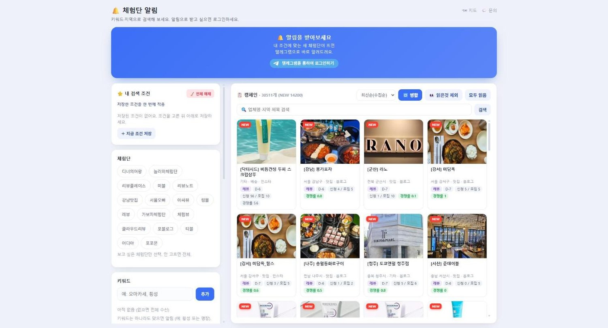
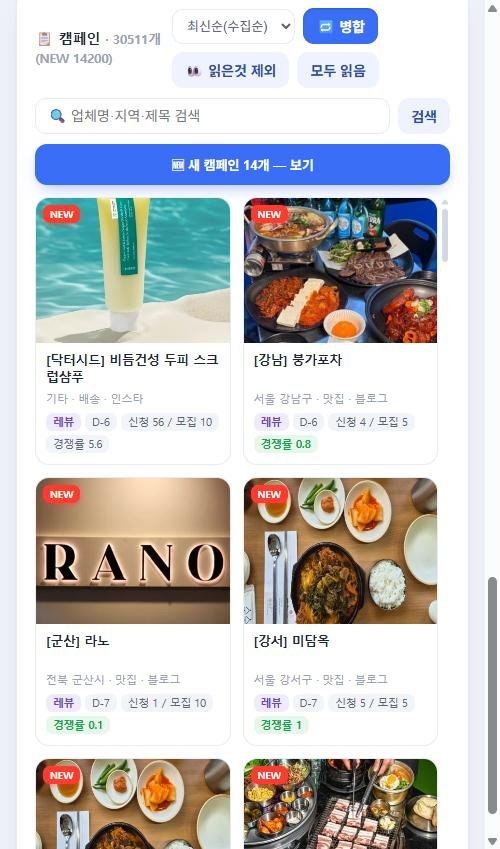
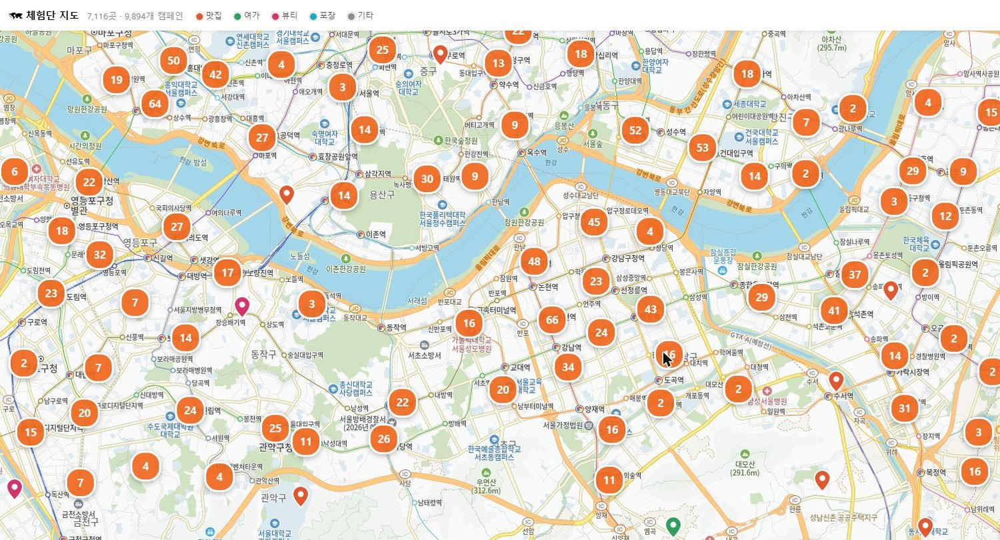

# alertview — 체험단 통합 피드

여기저기 흩어진 **체험단(리뷰 캠페인)** 모집 공고를 한 곳에 모아,
지역·카테고리·채널로 걸러 보고, 마감·경쟁률 순으로 정렬해 주는 서비스입니다.

**➡️ https://alertview.hj0128.com**



## ✨ 주요 기능

- **17개 체험단 사이트를 한 피드에서** — 디너의여왕 · 레뷰 · 리뷰노트 · 미블 · 강남맛집 · 체험뷰 등의 공고를 자동으로 모아 보여줍니다
- **원하는 조건만 골라 보기** — 지역 · 카테고리(맛집/여가/뷰티/배송/포장/페이백/기자단) · 채널(블로그/인스타/릴스/유튜브 등) · 키워드
- **당첨 확률로 거르기** — 경쟁률 · 마감일 · 모집수 · 지원수를 범위로 지정. "경쟁률 1 이하"처럼 노려볼 만한 공고만 추릴 수 있습니다
- **검색조건 저장** — 자주 쓰는 조건 조합을 저장해 한 번에 적용
- **텔레그램 알림** — 내 조건에 맞는 새 공고가 뜨면 바로 알려줍니다. 방해받고 싶지 않은 시간대도 지정할 수 있습니다
- **찜 · 읽음 처리** — 관심 공고를 저장하고, 이미 본 공고는 숨기기
- **중복 묶기** — 같은 업체가 채널만 바꿔 여러 건 올린 공고를 하나로 묶어 표시
- **지도로 보기** — 방문해야 하는 캠페인이 어디에 있는지 지도에서 확인

## 📱 모바일 · 지도

<table>
<tr>
<td width="38%"></td>
<td></td>
</tr>
</table>

## 🙋 사용 방법

1. **https://alertview.hj0128.com** 접속 — 로그인 없이도 전체 공고를 검색해 볼 수 있습니다
2. 알림을 받으려면 **텔레그램으로 로그인** (별도 가입 없이 텔레그램 계정으로 바로)
3. 왼쪽에서 **지역 · 카테고리 · 채널 · 키워드**를 고르고, 필요하면 경쟁률·마감일 범위까지 지정
4. 조건에 맞는 새 공고가 올라오면 **텔레그램으로 알림**이 옵니다

조건을 하나도 고르지 않으면 모든 새 공고를 받습니다. 자주 쓰는 조합은 저장해 두고 클릭 한 번으로 바꿔 적용할 수 있습니다.

## 🛠 기술 스택

| 영역 | 사용 기술 |
|---|---|
| 백엔드 | Python, **FastAPI**, Uvicorn |
| 수집 | **httpx** (async), **BeautifulSoup** — 사이트별 어댑터로 비동기 병렬 크롤링 |
| 저장소 | **PostgreSQL** (psycopg 3) |
| 알림 | python-telegram-bot |
| 지도 | Kakao Maps |
| 배포 | **Docker Compose** + Cloudflare Tunnel |

```
수집(Poller) ─▶ 어댑터 17종 ─▶ 분류·지역 정규화 ─▶ PostgreSQL ─┬─▶ 웹 피드
                                                              └─▶ 텔레그램 알림
```

---

*Made by [@hj0128](https://github.com/hj0128)*
